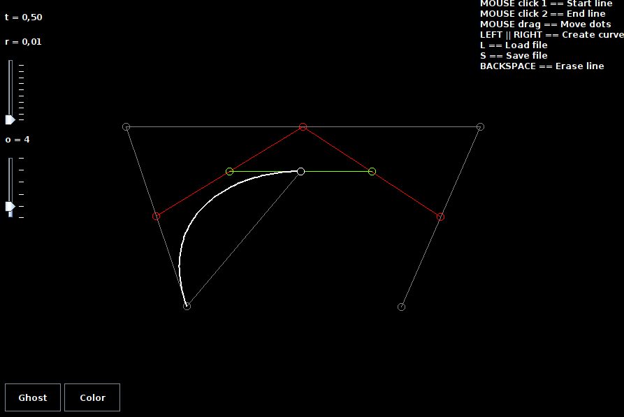
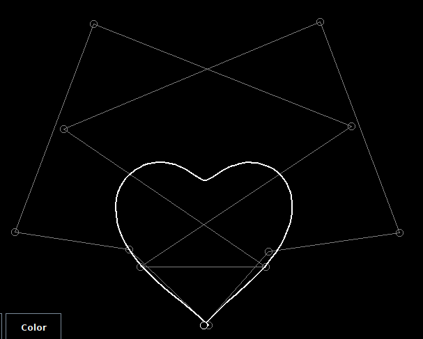

# Bezier Curve
This project is a Java Maven application built using NetBeans IDE and Swing that generates and visualizes **Bezier Curves** of different orders. Users can interact with the graphical interface to define control points and adjust the curve's resolution and order. The application supports saving and loading curve points from `.txt` file, along with various interactive features.

  

  

## **Features**

- **Define Control Points**: Click to set the start and end points of the curve.
- **Generate Bezier Curves**: Automatically generate Bezier curves of different orders based on the defined control points.
- **Adjust Resolution**: Use a slider to modify the curve's resolution.
- **Adjust Curve Order**: Change the curve order (minimum of 2 up to a maximum of 12).
- **Move Points**: Click and drag points to reposition them and update the curve in real time.
- **Save and Load**: Support for saving and loading point configurations.
- **Visual Customization**: Modify the background and enable or disable ghost visualization.

## **Usage**

### **Controls**

- **Mouse Click**:
  - *`*Left Button`**: Define the start or end point.
  - **`Drag`**: Move existing points.

- **Keyboard Keys**:
  - **`LEFT` / `RIGHT`**: Navigate along the Bezier curve by adjusting the `t` value.
  - **`L`**: Load points from a file.
  - **`S`**: Save points to a file.
  - **`BACKSPACE`**: Delete the current line.

## **Available Settings**

- **Resolution**:
  - **Adjustment**: Vertical slider.
  - **Range**: `0.01` to `0.5`.

- **Curve Order**:
  - **Adjustment**: Vertical slider.
  - **Range**: `2` to `12`.

- **Visualization**:
  - **Ghost Button**: Toggle ghost visualization on or off.
  - **Color Button**: Switch between black and white backgrounds.
